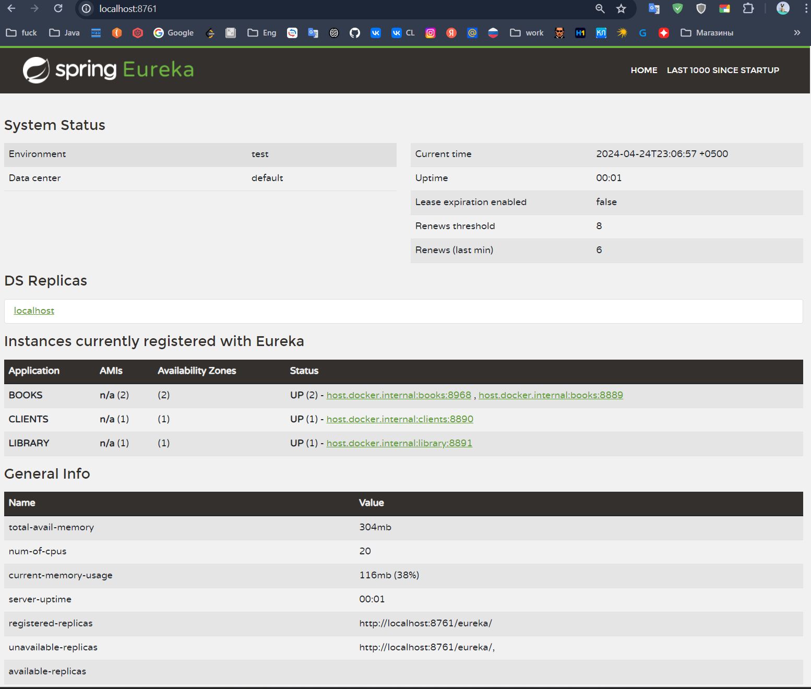
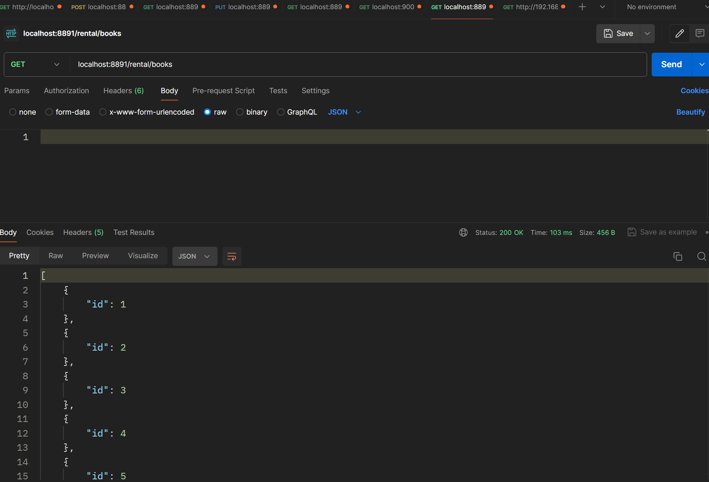

```java
@Configuration
public class WebClientConfig {
    @Bean
    @LoadBalanced
    public WebClient.Builder loadBalancedWebClientBuilder() {
        return WebClient.builder();
    }
}
```

### Именно использование вебклиентом балансера помогло заработать коду:

```java
@Service
@RequiredArgsConstructor
public class BookProvider {
    private final BookRepository bookRepository;
    private final String BASE_URI = "http://books/api/book";
//    private final RestClient restClient;
    private final WebClient.Builder builder;

    public List<Book> getNewBooks() {
        List<Book> books =builder.build().get()
                .uri(BASE_URI)
                .retrieve()
                .bodyToMono(new ParameterizedTypeReference<List<Book>>() {})
                .block();
        if (!books.isEmpty()) bookRepository.saveAll(books);
        return books;
    }

    public Book getBookById(Long id) {
        Book blocked = builder.build().get()
                .uri(BASE_URI + "/" + id)
                .retrieve().bodyToMono(Book.class).block();

        if (blocked == null) throw new NoSuchElementException();
        bookRepository.save(blocked);
        return blocked;
    }
}
```